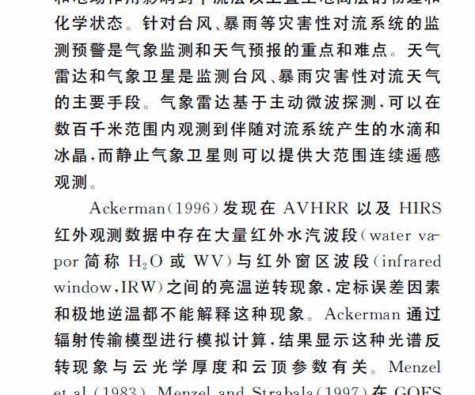

# 文献复制工具

用tkinter搭建的一个用于复制中英文文献文本内容的小程序。

用Pyinstaller打包的可执行程序（[百度网盘链接](https://pan.baidu.com/s/1Nt9PepIC1i4ZgGT6kwrrdg)）。

---

## 目的

为了解决从pdf等格式的中文文献中复制粘贴常会出现的一些问题：

- 数字、字母等非中文字符变成全角字符
- 产生多余的空格、换行
- 中、英文标点（全、半角）混乱
- 英文上下文中的标点后缺空格

## 实现

- 删除多余的空白符（换行、空格、制表等）
- 英文、数字、部分标点符号的全角字符换成半角字符
- 修正误判为中文标点（，；：！？）的英文标点字符
- 英文标点后确保一个空格

## 程序结构

程序主要结构有两个模块： ├── [organize.py](https://github.com/Mo-Dabao/ChinglishCopier/blob/master/organize.py) └── [gui_tkinter.py](https://github.com/Mo-Dabao/ChinglishCopier/blob/master/gui_tkinter.py)

`organize.py`负责逻辑操作：遍历复制的字符串按照条件整理。 `gui_tkinter.py`负责GUI的搭建。

这个程序从2018年开始断断续续当Python练手的项目在做，基本实现了既定目标——但是我已经不需要写课程报告了，只能在摘录文献记笔记的时候用一用了。**千万不要用于论文中，复制一时爽，一直复制一直爽！**

| 时间 | 备注 |
|--|--|
| 2018-10-04 | 创建 |
| 2018-10-26 | 优化空格、换行的删除逻辑；优化代码风格 |
| 2019-02-22 | 重构，优化中英文标点和空格的判断逻辑， 界面和逻辑分离；新增菜单栏，去掉广告窗口 |

**喜欢的话请关注吧，天晓得还会更新什么好玩儿的东西：**

